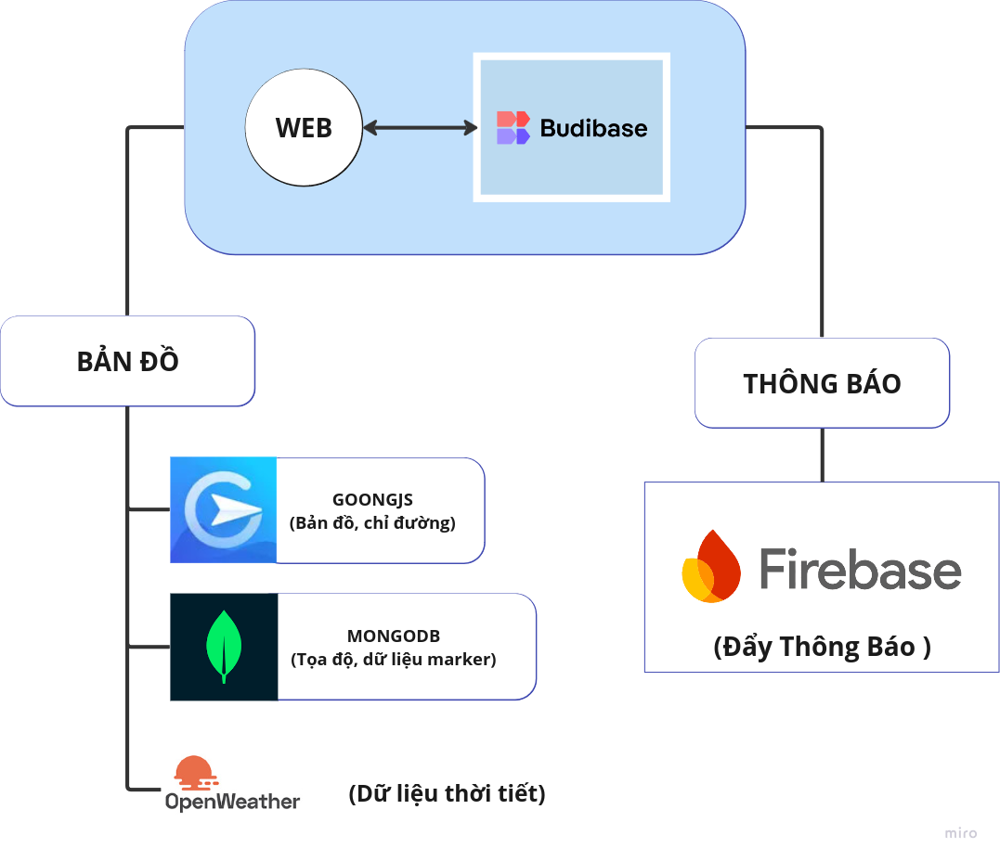

# Kiến trúc hệ thống 

## **Công nghệ sử dụng**
{ loading=lazy }

Hệ thống **Hỗ trợ thiên tai** được thiết kế với các thành phần chính như sau:


- Khi người dùng truy cập vào **FBeta App Budibase** để tương tác với các dịch vụ: 
- Thực hiện kết nối với các dịch vụ
     - **FBeta Map Service**: Cung cấp chức năng bản đồ, chỉ đường và marker.
     - **Notification Service**: Gửi thông báo đẩy đến người dùng.
- Trong đó: 
    - **Bản đồ**:
    - Tích hợp với **Goong API** để:
        - Hiển thị bản đồ.
        - Cung cấp chức năng chỉ đường.
        - Quản lý và hiển thị các marker dựa trên dữ liệu từ MongoDB.
    - **Thông báo**:
        - Sử dụng **Firebase** để gửi thông báo đẩy đến người dùng về các sự kiện quan trọng.

- **Goong API**:
    - Cung cấp các tính năng bản đồ, chỉ đường và marker.
   
- **MongoDB**:
    - Lưu trữ thông tin về các marker, bao gồm tọa độ (`lat`, `long`), và các dữ liệu liên quan.

## **CI/CD** 
### 1. Giới thiệu 
- CI/CD (Continuous Integration/Continuous Deployment) là một phần quan trọng trong quy trình phát triển phần mềm hiện đại, giúp tự động hóa quá trình kiểm tra, xây dựng, và triển khai ứng dụng. Phần CI/CD này được cấu hình thông qua GitHub Actions để tự động hóa quá trình triển khai tài liệu dựa trên công cụ MkDocs.

### 2. Cấu hình 
- Tên workflow: ci 
- Sự kiện kích hoạt: Workflow được kích hoạt mỗi khi có thay đổi (push) lên nhánh master.

### 3. Quy trình 
- Sử dụng Github Actions: 
    - **actions/checkout@v4**: Đầu tiên, code trong kho lưu trữ sẽ được checkout về máy chủ của GitHub Actions.
- Cấu hình thông tin Git:
    - Git được cấu hình để tự động sử dụng tên và email của GitHub Actions Bot để thực hiện các commit sau khi triển khai tài liệu.
    ```bash 
    git config user.name github-actions[bot]
    git config user.email 41898282+github-actions[bot]@users.noreply.github.com

    ```
- Cài đặt Python: 
    - Cấu hình Python phiên bản 3.x để sử dụng với công cụ MkDocs.
    ```yaml 
    - uses: actions/setup-python@v5
        with:
        python-version: 3.x

    ```
- Cấu hình Cache: 
    - Để giảm thời gian xây dựng lại các thư viện khi workflow chạy lại, cache được sử dụng với key là **mkdocs-material-${{ env.cache_id }}**. Cache giúp lưu trữ các thư viện như mkdocs-material, giảm tải cho các lần chạy sau.
    ```bash
    echo "cache_id=$(date --utc '+%V')" >> $GITHUB_ENV
    ```
- Cài đặt các thư viện: 
    - Cài đặt mkdocs-material và mkdocs-glightbox để sử dụng cho việc xây dựng tài liệu. 

        ```bash
        pip install mkdocs-material
        pip install mkdocs-glightbox

        ```
    
    !!! Note

        Nếu có thêm plugin trong file mkdoc.yml thì cần cài đặt thêm thư viện ở đây.
- Triển khai tài liệu: 
    - Cuối cùng, tài liệu được triển khai lên GitHub Pages thông qua lệnh mkdocs gh-deploy --force. Lệnh này sẽ thay thế tài liệu hiện tại trên trang GitHub Pages bằng tài liệu mới nhất từ kho lưu trữ. 

    ```bash
    mkdocs gh-deploy --force
    ```


### **4. Lợi ích** 

- Tự động hóa quy trình triển khai: Tự động hóa việc triển khai tài liệu mỗi khi có thay đổi trên nhánh master, giúp tiết kiệm thời gian và công sức.
- Tiết kiệm thời gian xây dựng lại: Sử dụng cache để tránh việc cài đặt lại các thư viện và giảm thời gian xây dựng cho các lần chạy kế tiếp.
- Bảo mật và chuẩn hóa thông tin Git: GitHub Actions sử dụng thông tin của bot để thực hiện các commit tự động, giúp quản lý phiên bản tài liệu dễ dàng hơn mà không cần phải sử dụng tài khoản cá nhân.

### **5. ci.yml**
```py linenums="1"
name: ci
on:
  push:
    branches:
      - master
permissions:
  contents: write
jobs:
  deploy:
    runs-on: ubuntu-latest
    steps:
      - uses: actions/checkout@v4
      - name: Configure Git Credentials
        run: |
          git config user.name github-actions[bot]
          git config user.email 41898282+github-actions[bot]@users.noreply.github.com
      - uses: actions/setup-python@v5
        with:
          python-version: 3.x
      - run: echo "cache_id=$(date --utc '+%V')" >> $GITHUB_ENV
      - uses: actions/cache@v4
        with:
          key: mkdocs-material-${{ env.cache_id }}
          path: .cache
          restore-keys: |
            mkdocs-material-
      - run: pip install mkdocs-material
      - run: pip install mkdocs-material mkdocs-glightbox
      - run: mkdocs gh-deploy --force
```

---