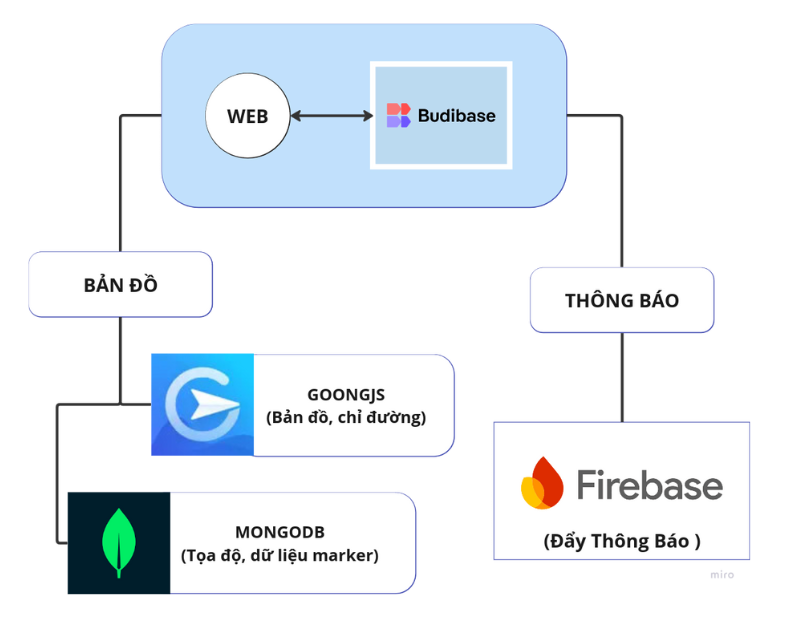

# Kiến trúc hệ thống 
{ loading=lazy }

## **Mô tả hệ thống**

Hệ thống **Hỗ trợ thiên tai** được thiết kế với các thành phần chính như sau:

- Khi người dùng truy cập vào **FBeta App Budibase** để tương tác với các dịch vụ: 
- Thực hiện kết nối với các dịch vụ
     - **FBeta Map Service**: Cung cấp chức năng bản đồ, chỉ đường và marker.
     - **Notification Service**: Gửi thông báo đẩy đến người dùng.
- Trong đó: 
    - **Bản đồ**:
    - Tích hợp với **Goong API** để:
        - Hiển thị bản đồ.
        - Cung cấp chức năng chỉ đường.
        - Quản lý và hiển thị các marker dựa trên dữ liệu từ MongoDB.
    - **Thông báo**:
        - Sử dụng **Firebase** để gửi thông báo đẩy đến người dùng về các sự kiện quan trọng.

- **Goong API**:
    - Cung cấp các tính năng bản đồ, chỉ đường và marker.
   
- **MongoDB**:
    - Lưu trữ thông tin về các marker, bao gồm tọa độ (`lat`, `long`), và các dữ liệu liên quan.

---