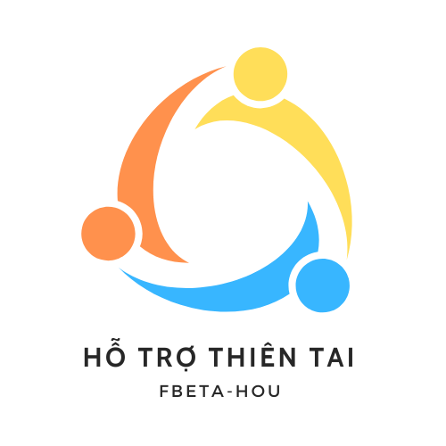

---
hide:
    - navigation
---
# Hỗ trợ thiên tai

{ align=right }

## Giới Thiệu Ứng Dụng
**Hỗ Trợ Thiên Tai** là ứng dụng cứu trợ thiên tai được thiết kế để hỗ trợ người dùng trong các tình huống khẩn cấp như bão, động đất, lũ quét, v.v. Ứng dụng cung cấp các tính năng như di tản an toàn, xem tin tức cập nhật về thiên tai, nhận thông báo đẩy và học hỏi các kỹ năng phòng tránh thiên tai.

-   :material-clock-fast:{ .lg .middle } __Set up in 5 minutes__

    ---

    Install [`mkdocs-material`](#) with [`pip`](#) and get up
    and running in minutes

    [:octicons-arrow-right-24: Getting started](#)

-   :fontawesome-brands-markdown:{ .lg .middle } __It's just Markdown__

    ---

    Focus on your content and generate a responsive and searchable static site

    [:octicons-arrow-right-24: Reference](#)

-   :material-format-font:{ .lg .middle } __Made to measure__

    ---

    Change the colors, fonts, language, icons, logo and more with a few lines

    [:octicons-arrow-right-24: Customization](#)

-   :material-scale-balance:{ .lg .middle } __Open Source, MIT__

    ---

    Material for MkDocs is licensed under MIT and available on [GitHub]

    [:octicons-arrow-right-24: License](#)

## Các Tính Năng Chính
1. **Di Tản Tới Khu Vực An Toàn**: Xem và chỉ đường đến các khu vực an toàn gần nhất.
2. **Cung Cấp Tin Tức**: Nhận tin tức mới nhất về thiên tai theo thời gian thực.
3. **Gửi Thông Báo Đẩy**: Admin có thể gửi thông báo cảnh báo đến người dùng.
4. **Cung Cấp Kiến Thức Thiên Tai**: Tìm hiểu về các loại thiên tai và cách phòng tránh.
5. **Nút SOS Khẩn Cấp**: Gửi yêu cầu cứu trợ khẩn cấp.

## Liên Hệ và Hỗ Trợ
- Email: 22a1001d0029@students.hou.edu.vn

## Changelog
- **Version 1.0.0**: Thêm tính năng tìm kiếm tin tức, cải tiến giao diện.
- **Version 0.0.1**: Phiên bản đầu tiên ra mắt.

## FAQ (Câu Hỏi Thường Gặp)

1. **Làm sao để nhận thông báo khẩn cấp?**
   - Kích hoạt thông báo đẩy trong phần cài đặt của ứng dụng.
